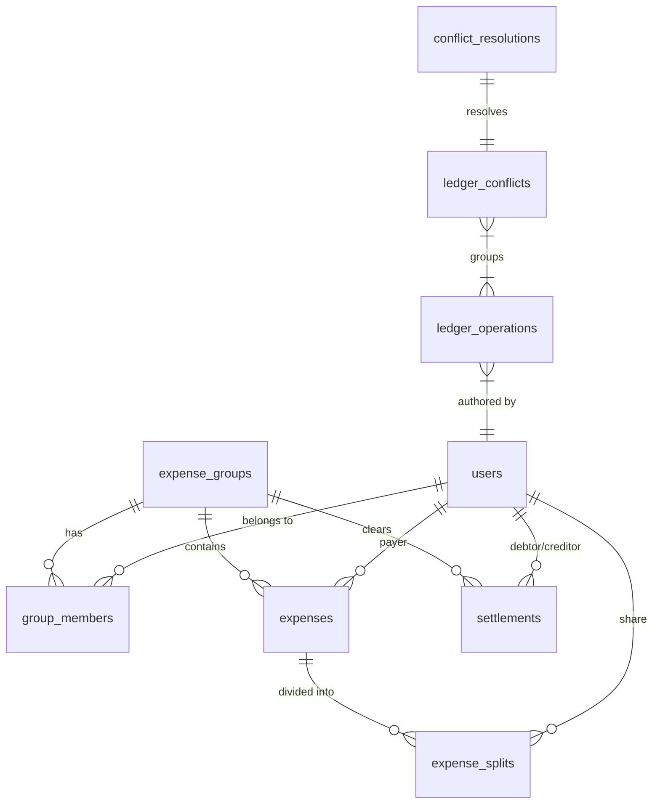

# SplitEase

**An Offline-First Android Expense Sharing Application**

SplitEase is a modern Android application for managing shared expenses among groups of people. Whether you're splitting bills with roommates, tracking trip expenses with friends, or managing household costs with family, SplitEase makes it simple and reliable.

---

## 📖 Table of Contents

1. [Project Overview](#1-project-overview-for-laymen)
2. [Feature Set](#2-feature-set)
3. [High-Level Architecture](#3-high-level-architecture-hld)
4. [Low-Level Architecture](#4-low-level-architecture-lld)
5. [Database Design](#5-database-design-room)
6. [Sync Engine](#6-sync-engine-offline-first-deep-dive)
7. [Networking & APIs](#7-networking--apis)
8. [Dependency Injection](#8-dependency-injection-hilt--ksp)
9. [Navigation & UI Flow](#9-navigation--ui-flow)
10. [How to Run the Project](#10-how-to-run-the-project)
11. [Testing Guide](#11-testing-guide)
12. [Debugging & Troubleshooting](#12-debugging--troubleshooting)
13. [How to Extend the App Safely](#13-how-to-extend-the-app-safely)
14. [Non-Goals & Intentional Omissions](#14-non-goals--intentional-omissions)
15. [Project Philosophy](#15-project-philosophy)
16. [Consistency & Reliability](#16-consistency--reliability)

---

## 1. Project Overview (For Laymen)

### What is SplitEase?

SplitEase is a mobile app for Android that helps groups of people track and split shared expenses. Think of it as a digital ledger that keeps track of "who paid what" and "who owes whom."

### Who is it for?

- **Roommates** splitting rent, utilities, and groceries
- **Friends** sharing costs on a trip or vacation
- **Couples** managing household expenses together
- **Anyone** who shares costs and wants to avoid awkward "you owe me" conversations

### Problem Statement

Managing shared group finances is inherently difficult due to three primary challenges:
1. **Concurrency**: Multiple users adding or editing expenses simultaneously leads to state drift.
2. **Offline Periods**: Users need to record expenses in remote locations without internet, requiring robust later-stage synchronization.
3. **Auditability**: Financial systems require a clear history of "why" a balance changed, not just the final total.

Most existing solutions rely on "Last-Writer-Wins" or simple state-replacement sync, which leads to data loss and "ghost" mutations. SplitEase solves this by treating the application state as a **derived function of an immutable ledger**, ensuring every device converges to the exact same state deterministically.

### Key Guarantees

| Guarantee | Description |
|-----------|-------------|
| **Offline-First** | Add expenses even without internet. Data syncs when you're back online. |
| **No Data Loss** | All changes are saved locally first. The app never loses your data. |
| **Reliable Sync** | Background sync retries automatically until successful. |
| **Financial Accuracy** | Uses `BigDecimal` for all money calculations. No rounding errors. |

---

## 2. Feature Set

### ✅ Implemented Features

| Feature | Status | Description |
|---------|--------|-------------|
| **Authentication** | ✅ Mocked | Login/Signup screens with mock backend |
| **Groups** | ✅ Complete | Create, view, and manage expense groups |
| **Group Creation** | ✅ Complete | Create new groups with name, type, and member selection |
| **Expenses** | ✅ Complete | Add expenses with title, amount, payer, date |
| **Expense Editing** | ✅ Complete | Edit existing expenses |
| **Expense Deletion** | ✅ Complete | Delete expenses with sync support |
| **Equal Splits** | ✅ Complete | Automatically split expenses equally |
| **Percentage Splits** | ✅ Complete | Split by custom percentages |
| **Exact Amount Splits** | ✅ Complete | Split by specific amounts per person |
| **Split Type Inference** | ✅ Complete | Smart detection of EQUAL/PERCENTAGE/EXACT splits |
| **Settlements** | ✅ Complete | Record payments between users |
| **Partial Settlements** | ✅ Complete | Pay any amount (full or partial) |
| **Multi-Settlement** | ✅ Complete | Multiple settlements per debtor pair |
| **Debt Simplification** | ✅ Complete | Toggle between simplified and proportional view |
| **Balance Calculation** | ✅ Complete | Real-time "who owes whom" calculations |
| **Expense Date Support** | ✅ Complete | Custom date picker for expenses |
| **Trip Date Range** | ✅ Complete | Groups support start/end dates |
| **Offline Mode** | ✅ Complete | Full functionality without internet |
| **Background Sync** | ✅ Complete | WorkManager-based reliable sync |
| **Sync Failure Handling** | ✅ Complete | Categorized failures (VALIDATION, AUTH, NETWORK, UNKNOWN) |
| **Sync Issues Screen** | ✅ Complete | View, retry, and manage failed sync operations |
| **Sync Status Visibility** | ✅ Complete | Global and group-scoped sync indicators |
| **Manual Sync Control** | ✅ Complete | "Sync Now" button with debounce protection |
| **Sync Health Telemetry** | ✅ Complete | PAUSED state detection for stuck operations |
| **Conflict Detection** | ✅ Complete | Explicit, deterministic detection of multi-device mutations |
| **Conflict Identity** | ✅ Complete | SHA-256 stable fingerprints for audit-safe history |
| **Explicit Resolution** | ✅ Complete | User-driven resolution operations supported by derivation-layer filtering |
| **Derivation Integrity** | ✅ Complete | "Loser" history remains in DB for audit but is hidden from UI/Effective State |
| **Order Independence** | ✅ Complete | Results are consistent regardless of whether resolution arrives before or after data |
| **Supabase Mirror (Push)** | ✅ Internal | Upload stream feeding the deterministic **Supabase Mirror (Pull)** workflow |
| **Supabase Mirror (Pull)** | ✅ Complete | Incremental pull and deterministic replay of remote ledger operations |
| **Dumb Courier Architecture** | ✅ Complete | Supabase serves as durable exchange layer; local app maintains logic/authority |
| **Audit & Hardening** | ✅ Complete | **Sprint 23.1**: Verified concurrency safety, correct attribution, and role semantics via CodeRabbit audit. |
| **CodeRabbit Fixes** | ✅ Complete | **Sprint 23.2**: Fixed race conditions, auth errors, and sync logic bugs. |


### 🎯 Sync Status Indicators

| State | Icon | Meaning |
|-------|------|--------|
| FAILED | ⚠️ | Some changes couldn't be synced |
| PAUSED | 💤 | Sync paused — waiting for network (pending > 5 min) |
| SYNCING | ⏳ | Syncing changes... |
| IDLE | — | Everything synced |

### ⚠️ Intentionally Mocked & Partially Integrated
| Component | Status | Why |
|-----------|---|-----|
| **Authentication Backend** | ⚠️ Partially Real | JWT support implemented for Supabase; Mock UI Login remains for Dev speed. |
| **Remote API (Entity Sync)** | ⚠️ Mocked | Legacy entity-sync uses OkHttp interceptor simulation. |
| **Ledger Mirror** | ✅ **Real (Supabase)** | **Sprint 21**: Real PostgREST integration for durable ledger mirroring. |
| **User Data Fetch** | ⚠️ Mocked | Seed data used for local users not yet linked to Supabase profiles. |

### 🚧 Future Features (Not Implemented)

- Real authentication (OAuth, JWT)
- Push notifications for expense updates
- Currency conversion
- Receipt image attachments
- Export to CSV/PDF

---

### 3. High-Level Architecture (HLD)

SplitEase follows **MVVM (Model-View-ViewModel)** with strict **Unidirectional Data Flow (UDF)**.

### Core Architectural Pillars

1. **Offline-First**: The local database (Room) is the single source of truth. The UI never observes network responses directly.

2. **Three-Tier Convergence Logic**:
    - **Tier 1: Deterministic Reconciliation (`ReplayEngine`)**: Authoritatively executes all ledger history unconditionally to ensure raw state convergence.
    - **Tier 2: Explicit Conflict Detection (`ConflictDetector`)**: Surfaces multi-device mutation facts (conflicts) as read-only metadata.
    - **Tier 3: Explicit Conflict Resolution (Derivation)**: Repositories join resolution "facts" with raw state to project the Effective State (hiding Zombies/Losers) without corrupting the historical record.

3. **Atomic Identity Linking**:
    - **`ClaimManager`**: Orchestrates secure invite claiming and inviter discovery.
    - **`AppDatabase.mergePhantomToReal`**: Atomic transaction that reassigns all foreign-key references from a local phantom user to a real cloud user without data loss.

4. **Unidirectional Data Flow**: Data flows in one direction:
   ```
   User Action → ViewModel → Repository → Room → Flow → UI
   ```

3. **Separation of Concerns**:
   - **UI Layer**: Display only (no business logic)
   - **ViewModel**: State orchestration
   - **Domain Layer**: Pure business logic (calculations, validations)
   - **Data Layer**: Database and network operations

### Data Flow Diagram (ASCII)

```
┌─────────────────────────────────────────────────────────────────────────┐
│                            UI LAYER (Compose)                           │
│  ┌──────────────┐        ┌───────────────┐        ┌──────────────────┐  │
│  │   Screens    │◀───────│   ViewModel   │◀───────│StateFlow<UiState>│  │
│  └──────────────┘        └───────┬───────┘        └──────────────────┘  │
└──────────────────────────────────┼──────────────────────────────────────┘
                                   │ User Action (Write) / Observation (Read)
                                   ▼
┌─────────────────────────────────────────────────────────────────────────┐
│                           REPOSITORY LAYER                              │
│  ┌───────────────────────────────────────────────────────────────────┐  │
│  │  Writes: Appends [LedgerOperation] to DB + Triggers Sync          │  │
│  │  Reads:  Observes [Room] Entity Streams (Instant + Offline)       │  │
│  └───────────────────────────────┬───────────────────────────────────┘  │
└──────────────────────────────────┼──────────────────────────────────────┘
                                   │
        ┌──────────────────────────┴──────────────────────────┐
        ▼                                                     ▼
┌───────────────────────────────┐      ┌────────────────────────────────┐
│       WRITE PATH (PUSH)       │      │       READ PATH (PULL)         │
│                               │      │                                │
│ 1. DB: [ledger_operations]    │      │ 1. [Remote API]: Pull Ops      │
│ 2. WorkManager: [PushWorker]  │      │ 2. [ReplayEngine]: Tier 1      │
│ 3. [Remote Service]: Mirror   │      │    (Deterministic Replay)      │
│                               │      │ 3. [ConflictDetector]: Tier 2  │
│                               │      │    (Multi-Device Detection)    │
└───────────────┬───────────────┘      └──────────────┬─────────────────┘
                │                                     │
                └───────────────┬─────────────────────┘
                                ▼
                    ┌────────────────────────┐
                    │     ROOM DATABASE      │
                    │ (Single Source of Truth)│
                    │ ┌────────────────────┐ │
                    │ │  Local States      │ │
                    │ ├────────────────────┤ │
                    │ │  Ledger History    │ │
                    │ ├────────────────────┤ │
                    │ │  Conflict Metadata │ │
                    │ └────────────────────┘ │
                    └────────────────────────┘
```


### Why This Architecture?

| Decision | Reason |
|----------|--------|
| Room as SSOT | Instant UI updates, offline support, data persistence |
| MVVM | Clear separation, testable, Compose-friendly |
| WorkManager for Sync | Survives process death, respects battery, handles retries |
| Hilt for DI | Compile-time safety, Android-aware lifecycle |

---

## 4. Low-Level Architecture (LLD)

### Layer Responsibilities

#### UI Layer (`ui/`)
- **Technology**: Jetpack Compose
- **Components**: Screens, ViewModels, Navigation
- **Rules**:
  - ❌ Never access DAOs directly
  - ❌ Never call API directly
  - ✅ Only observe StateFlow from ViewModel
  - ✅ Only call ViewModel functions for actions

#### ViewModel Layer
- **Technology**: AndroidX ViewModel + Hilt
- **Responsibilities**:
  - Transform repository data into UI state
  - Handle user actions
  - Expose `StateFlow<UiState>` for reactive UI
- **Pattern**: Single `sealed interface UiState` with Loading/Success/Error states

#### Domain Layer (`domain/`)
- **Technology**: Pure Kotlin (no Android dependencies)
- **Components**:
  - `SplitValidator`: Validates expense splits (EQUAL, PERCENTAGE, EXACT)
  - `SplitTypeInferrer`: Smart detection of split type from data
  - `BalanceCalculator`: Computes net balances from expenses and settlements
  - `SettlementCalculator`: Generates payment suggestions (simplified or proportional)
  - `MoneyFormatter`: Currency formatting utilities
- **Rules**:
  - ✅ Pure functions, deterministic
  - ✅ Unit testable without Android
  - ✅ Uses `BigDecimal` for all money

#### Data Layer (`data/`)
- **Local** (`data/local/`):
  - `AppDatabase`: Room database
  - `entities/`: 7 Room entities
  - `dao/`: 4 Data Access Objects
  - `converters/`: Type converters (Date, BigDecimal)
- **Remote** (`data/remote/`):
  - `SplitEaseApi`: Retrofit interface
  - Mock interceptor for fake responses
- **Repository** (`data/repository/`):
  - `AuthRepository`: Login/logout, token storage
  - `ExpenseRepository`: Expense CRUD with sync
  - `GroupRepository`: Group management and participant coordination
  - `SettlementRepository`: Settlement recording with sync
  - `SyncRepository`: Sync queue, health monitoring, manual triggers
- **Sync** (`data/sync/`):
  - `SyncHealth`: Derived sync state model
  - `SyncState`: State enum (FAILED, PAUSED, SYNCING, IDLE)
  - `SyncConstants`: Thresholds and timing constants

#### Background Layer (`worker/`)
- **Technology**: WorkManager + Hilt
- **Components**: `SyncWorker`
- **Responsibility**: Process sync queue reliably

---

## 5. Database Design (Room)

### DB Schema Diagram



### Why Room is Central

Room is the **Single Source of Truth (SSOT)**. Every piece of data the UI displays comes from Room, not from network responses. This guarantees:
- Offline functionality
- Consistent UI state
- Atomic writes

### Entity Schema

#### `users` Table
| Column | Type | Description |
|--------|------|-------------|
| `id` | TEXT (PK) | UUID |
| `name` | TEXT | Display name |
| `email` | TEXT | Email address |
| `profileUrl` | TEXT? | Avatar URL (nullable) |

#### `expense_groups` Table
| Column | Type | Description |
|--------|------|-------------|
| `id` | TEXT (PK) | UUID |
| `name` | TEXT | Group name |
| `type` | TEXT | "Trip", "Home", "Couple" |
| `coverUrl` | TEXT? | Group image URL |
| `createdBy` | TEXT | Creator user ID |

#### `group_members` Table (Junction)
| Column | Type | Description |
|--------|------|-------------|
| `groupId` | TEXT (PK) | FK to groups |
| `userId` | TEXT (PK) | FK to users |
| `joinedAt` | INTEGER | Timestamp |

#### `expenses` Table
| Column | Type | Description |
|--------|------|-------------|
| `id` | TEXT (PK) | UUID |
| `groupId` | TEXT | FK to groups |
| `title` | TEXT | Expense description |
| `amount` | TEXT | BigDecimal as string |
| `currency` | TEXT | "INR" default |
| `date` | INTEGER | Timestamp |
| `payerId` | TEXT | Who paid |
| `createdBy` | TEXT | Who created |
| `syncStatus` | TEXT | "PENDING" or "SYNCED" |

#### `expense_splits` Table
| Column | Type | Description |
|--------|------|-------------|
| `expenseId` | TEXT (PK) | FK to expenses |
| `userId` | TEXT (PK) | FK to users |
| `amount` | TEXT | Share amount |

#### `settlements` Table
| Column | Type | Description |
|--------|------|-------------|
| `id` | TEXT (PK) | UUID |
| `groupId` | TEXT | FK to groups |
| `fromUserId` | TEXT | Debtor |
| `toUserId` | TEXT | Creditor |
| `amount` | TEXT | Payment amount |
| `date` | INTEGER | Timestamp |

#### `sync_operations` Table (Legacy Sync Queue)
| Column | Type | Description |
|--------|------|-------------|
| `id` | INTEGER (PK) | Auto-increment (FIFO order) |
| `operationType` | TEXT | "CREATE", "UPDATE", "DELETE" |
| `entityType` | TEXT | "EXPENSE", "GROUP", "MEMBER" |
| `entityId` | TEXT | Entity UUID |
| `payload` | TEXT | JSON serialization |
| `status` | TEXT | "PENDING", "SYNCED", "FAILED" |
| `failureReason` | TEXT? | Error message if failed |
| `failureType` | TEXT? | "VALIDATION", "AUTH", "NETWORK", "UNKNOWN" |

#### `ledger_operations` Table (Modern Financial Ledger)
| Column | Type | Description |
|--------|------|-------------|
| `operationId` | TEXT (PK) | Unique UUID for the operation |
| `deviceId` | TEXT | ID of the device that created the record |
| `logicalClock` | INTEGER | Monotonic per-device counter (Authoritative) |
| `payload` | TEXT | Full entity snapshot (JSON) |

#### `ledger_conflicts` Table (Diagnostic Metadata)
| Column | Type | Description |
|--------|------|-------------|
| `conflictId` | TEXT (PK) | Deterministic SHA-256 fingerprint |
| `entityId` | TEXT | ID of the conflicted entity |
| `opRefs` | TEXT | JSON list of involved (deviceId:clock) pairs |

#### `conflict_resolutions` Table (Derived State)
| Column | Type | Description |
|--------|------|-------------|
| `conflictId` | TEXT (PK) | The conflict being resolved |
| `resolutionType` | TEXT | `KEEP_OPERATION` or `MANUAL_MERGE` |
| `chosenOpRef` | TEXT | The winning (deviceId:clock) pair |
| `appliedAt` | INTEGER | Logical context timestamp |

### How Write-Ahead Sync Works

1. **User Action**: Add expense
2. **Immediate Write**: Expense saved to `expenses` table
3. **Queue Entry**: `SyncOperation` created in `sync_operations`
4. **UI Update**: Flow emits, UI shows new expense
5. **Background Sync**: WorkManager processes queue
6. **Cleanup**: On success, operation deleted from queue

---

## 6. Sync Engine (Offline-First Deep Dive)

### Timeline Example: Adding Expense Offline

```
TIME    │ USER                          │ APP (LOCAL)                    │ NETWORK
────────┼───────────────────────────────┼────────────────────────────────┼─────────
T+0s    │ Opens app (airplane mode)     │ App loads from Room            │ ❌
T+5s    │ Adds expense "Dinner ₹500"    │ 1. Insert to `expenses`        │ ❌
        │                               │ 2. Insert to `sync_operations` │
        │                               │ 3. Flow emits → UI updates     │
T+6s    │ Sees expense in list          │ Data shown from Room           │ ❌
T+30m   │ Disables airplane mode        │ WorkManager triggers           │ ✅
        │                               │ SyncWorker starts              │
        │                               │ Reads from sync_operations     │
        │                               │ Calls API.sync()               │
        │                               │                                │ ✅ 200 OK
        │                               │ Deletes from sync_operations   │
T+31m   │ (No visible change)           │ Queue is now empty             │
```

### What Happens When Offline?

1. **Write Path**: Works normally. Data saved to Room.
2. **Read Path**: Works normally. UI observes Room flows.
3. **Sync Path**: `SyncWorker` is enqueued but waits for network.

### Idempotency Guarantees

Each `SyncOperation` has a unique `operationId`. The (mocked) API accepts duplicates safely. If the app crashes mid-sync, the operation remains in queue and retries.

### Failure Handling & Retries

| Scenario | Behavior |
|----------|----------|
| No network | WorkManager waits for connectivity |
| HTTP 4xx | Marked as FAILED (VALIDATION type), user can retry or delete |
| HTTP 401/403 | Marked as FAILED (AUTH type), filtered from UI |
| HTTP 5xx | Transient, WorkManager retries automatically |
| App killed | WorkManager resumes on restart |

### Sync Health States

| State | Condition | UI |
|-------|-----------|----|
| FAILED | `failedCount > 0` | ⚠️ Red warning icon |
| PAUSED | `pendingCount > 0 AND age > 5 min` | 💤 Tertiary icon |
| SYNCING | `pendingCount > 0` | ⏳ Neutral icon |
| IDLE | No pending operations | No indicator |

---

## 7. Networking & APIs

### Technology Stack

- **Retrofit**: Type-safe HTTP client
- **OkHttp**: HTTP engine with interceptor support
- **Gson**: JSON serialization

### Mock Interceptor

The app uses a `MockAuthInterceptor` that intercepts HTTP requests and returns fake responses without hitting a real server.

```kotlin
// Fake login always succeeds
POST /auth/login → {"userId": "mock-123", "token": "fake-token", ...}

// Fake sync always succeeds
POST /sync → {"success": true}
```

### API Contract

#### `POST /auth/login`
```json
// Request
{ "email": "user@example.com" }

// Response
{
  "userId": "uuid",
  "token": "jwt-token",
  "name": "User Name",
  "email": "user@example.com"
}
```

#### `POST /auth/signup`
```json
// Request
{ "name": "User", "email": "user@example.com" }

// Response
{ "userId": "uuid", "token": "jwt-token", ... }
```

#### `POST /sync`
```json
// Request (Push)
{
  "operationId": "123",
  "entityType": "EXPENSE",
  "operationType": "CREATE",
  "payload": "{...json...}"
}

// Response
{ "success": true, "message": "" }
```

#### `GET /ledger/pull`
```json
// Request
// GET /ledger/pull?sinceDeviceId=dev1&sinceClock=10

// Response
{
  "operations": [
    {
      "operationId": "456",
      "entityType": "GROUP",
      "entityId": "g1",
      "operationType": "UPDATE",
      "payload": "{...}",
      "deviceId": "dev2",
      "logicalClock": 11,
      "createdAt": 1700000000000
    }
  ],
  "highWaterMarks": {
    "dev1": 10,
    "dev2": 11
  }
}
```

---

## 8. Dependency Injection (Hilt + KSP)

### Why Hilt?

- Compile-time dependency resolution (fails fast)
- Android-aware (lifecycle-scoped)
- Less boilerplate than Dagger

### Modules Overview

| Module | Scope | Provides |
|--------|-------|----------|
| `DatabaseModule` | Singleton | `AppDatabase`, all DAOs |
| `NetworkModule` | Singleton | OkHttp, Retrofit, API |
| `DataModule` | Singleton | Repository bindings |
| `SecurityModule` | Singleton | EncryptedSharedPreferences |

### KSP Constraint: Explicit Return Types

**CRITICAL**: All `@Provides` methods MUST have explicit return types.

```kotlin
// ✅ CORRECT
@Provides
fun provideUserDao(db: AppDatabase): UserDao {
    return db.userDao()
}

// ❌ WRONG (causes KSP errors)
@Provides
fun provideUserDao(db: AppDatabase) = db.userDao()
```

### What NOT to Do

- ❌ Use abstract classes for `@Provides` (only for `@Binds`)
- ❌ Inject DAOs directly into Composables
- ❌ Create singletons manually (let Hilt manage them)

---

## 9. Navigation & UI Flow

### App Start Flow

```
App Launch
    │
    ▼
Check Auth Token (EncryptedSharedPreferences)
    │
    ├── No Token ──────▶ Auth Graph (Login/Signup)
    │
    └── Has Token ─────▶ Main Graph (Dashboard)
```

### Navigation Graph Structure

```
ROOT NavHost
    │
    ├── Auth Graph
    │   ├── LoginScreen
    │   └── SignupScreen
    │
    └── Main Graph (Groups = start)
        ├── Groups (Bottom Nav visible)
        ├── Activity (Bottom Nav visible)
        ├── Account (Bottom Nav visible)
        │
        └── Detail Sub-Graph (Bottom Nav HIDDEN)
            ├── GroupDetailScreen
            ├── AddExpenseScreen
            ├── CreateGroupScreen
            └── SyncIssuesScreen
```

### Navigation Arguments

| Route | Arguments | Passed Via |
|-------|-----------|------------|
| `group_detail/{groupId}` | `groupId: String` | `SavedStateHandle` |
| `add_expense/{groupId}` | `groupId: String` | `SavedStateHandle` |
| `add_expense/{groupId}/{expenseId}` | `groupId`, `expenseId` | `SavedStateHandle` |
| `create_group` | None | — |
| `sync_issues` | None | — |

### Backstack Rules

- Login success → Clear backstack, go to Groups
- AddExpense success → Pop back to GroupDetail
- CreateGroup success → Pop back to Groups
- Logout → Clear everything, go to Login

---

## 10. How to Run the Project

### Prerequisites

| Requirement | Version |
|-------------|---------|
| Android Studio | Ladybug (2024.2) or newer |
| JDK | 17 or 21 (NOT 25) |
| Gradle | 8.x (wrapper included) |
| Android SDK | API 24+ (minSdk) |

### Step-by-Step

1. **Clone the Repository**
   ```powershell
   git clone https://github.com/your-username/SplitEase.git
   cd SplitEase
   ```

2. **Configure JDK**
   Ensure `JAVA_HOME` points to JDK 17 or 21, or set in `gradle.properties`:
   ```properties
   org.gradle.java.home=C:\\Program Files\\Java\\jdk-21
   ```

3. **Sync Project**
   Open in Android Studio. It auto-syncs. If not:
   **File → Sync Project with Gradle Files**

4. **Build**
   ```powershell
   .\gradlew assembleDebug
   ```

5. **Run**
   - Connect device or start emulator
   - Press **Run** (Shift+F10)

### First Launch

1. App opens to Login screen
2. Click "Sign Up"
3. Enter any name/email/password (mocked)
4. Land on Dashboard

---

## 11. Testing Guide

### Unit Tests (Domain Logic)

```powershell
.\gradlew testDebugUnitTest
```

Tests pure Kotlin logic like `SplitValidator`.

### Instrumented Tests (Room/DAO)

```powershell
.\gradlew connectedDebugAndroidTest
```

Requires connected device/emulator.

### Testing Offline Sync Manually

1. Enable **Airplane Mode**
2. Add an expense
3. Open **App Inspection → Database Inspector**
4. Check `sync_operations` table → Should have 1 row
5. Disable Airplane Mode
6. Wait or force sync via **Background Task Inspector**
7. `sync_operations` should be empty

### Force WorkManager Execution

In Android Studio:
1. **View → Tool Windows → App Inspection**
2. Select your app
3. Go to **Background Task Inspector**
4. Find `sync_now` work
5. Click **Run**

---

## 12. Debugging & Troubleshooting

### Common Issues

| Issue | Solution |
|-------|----------|
| `error.NonExistentClass` | Clean build: `.\gradlew clean assembleDebug` |
| `IllegalArgumentException: 25.0.1` | Use JDK 17 or 21, not 25 |
| OOM during build | Already set `-Xmx4g` in gradle.properties |
| "Cannot find Room schema" | Ensure KSP is running, not KAPT |

### Where to Look First

1. **Logcat Tags**:
   - `SyncRepository` - Sync success/failure
   - `SyncWorker` - WorkManager execution
   - `AuthRepository` - Login/logout

2. **Database Inspector**:
   - Check `sync_operations` for pending items
   - Verify `expenses` table has your data

3. **Build Output**:
   - KSP errors appear in `:app:kspDebugKotlin`

### Sync Not Working?

1. Is network connected?
2. Is WorkManager running? (Background Task Inspector)
3. Check Logcat for `SyncWorker` errors
4. Check `sync_operations` table for stuck items

---

## 13. How to Extend the App Safely

### Adding a New Screen

1. Create `XxxScreen.kt` in appropriate `ui/` subfolder
2. Create `XxxViewModel.kt` with `@HiltViewModel`
3. Add route to `Screen.kt`
4. Register in `MainScaffold.kt` NavHost
5. Wire navigation callbacks

### Adding a New Entity

1. Create data class in `data/local/entities/`
2. Add `@Entity` annotation with table name
3. Add to `AppDatabase` entities list
4. Create DAO in `data/local/dao/`
5. Add DAO provider in `DatabaseModule`
6. Increment database version and add migration

### Adding a New Syncable Operation

1. Write to local table first
2. Create `SyncOperation` with JSON payload
3. Call `syncRepository.enqueueOperation()`
4. Handle in `SyncRepository.processNextOperation()`

### Architectural Rules to Follow

- ✅ Always write to Room first
- ✅ Always use `BigDecimal` for money
- ✅ Always expose `StateFlow` from ViewModel
- ✅ Always use explicit return types in DI modules
- ❌ Never observe network in UI
- ❌ Never access DAO from Composables
- ❌ Never use `Double` for money

---

## 14. Non-Goals & Intentional Omissions

### Why Auth is Mocked

Building a real auth backend (OAuth, JWT, session management) is outside the scope of this architectural demo. The mock allows testing the full app flow without infrastructure.

### Why Backend is Minimal

The app demonstrates **client-side offline-first architecture**. A real backend would be identical in interface but require deployment, monitoring, etc.

### Why Focus is on Architecture

This project prioritizes:
- Correct data flow patterns
- Reliable offline sync
- Production-grade error handling
- Clean, maintainable code

Over:
- UI polish
- Feature completeness
- Real authentication

---

## 15. Project Philosophy

### 1. Offline-First Mindset

> "The network is a lie."

Always assume the network will fail. Write locally, sync later. The user should never see a loading spinner for data they already own.

### 2. Data Correctness Over UI Polish

A beautiful app that loses data is worthless. An ugly app that never loses data is invaluable. SplitEase chooses the latter.

### 3. Deterministic Behavior

Given the same inputs, the app produces the same outputs. Split calculations use `BigDecimal` with explicit rounding. Sync operations process in FIFO order.

### 4. Production-Grade Patterns

Even though this is a demo, it uses patterns you'd find in production apps:
- WorkManager for reliability
- Room as SSOT
- Hilt for compile-time safety
- Sealed classes for exhaustive state handling

---

## 16. Consistency & Reliability

### Consistency Guarantees
- **Eventual Consistency**: All devices will reach identical state once all ledger operations propagate.
- **Causal Consistency**: Multi-device operations are ordered by deterministic clocks, preventing "effect before cause" paradoxes.
- **Monotonic Read/Writes**: Users never see their own data "disappear" then reappear during sync.

### Scaling Strategy
- **Horizontal Ledger Sharding**: The ledger is partitionable by `groupId`, allowing the backend to scale linearly across clusters.
- **Delta-Only Pulls**: Clients only fetch the high-water mark delta, minimizing bandwidth.
- **Checkpointing**: (Planned) Periodic entity snapshots allow truncating the ledger for faster hydration of new devices.

### Tradeoffs
- **Complexity vs. Simplicity**: Using a ledger (Event Sourcing) is more complex than state-sync but prevents silent data loss.
- **Storage Overhead**: Storing full operation history increases local DB size. This is mitigated by the low throughput of financial records.
- **Write Throttling**: The `LedgerWriteGate` ensures atomic clocks at the cost of slight UI write latency (sub-10ms).

---

## 📄 License

This project is licensed under the **MIT License**.

You are free to:
- Use the code for personal or commercial projects
- Modify and distribute it
- Fork and build upon it

Under the condition that:
- The original copyright notice
- And this permission notice

are included in all copies or substantial portions of the software.

See the [LICENSE](LICENSE.md) file for full details.


---

## 🤝 Contributing

Contributions are welcome and appreciated! 🎉  
This project is intended as a **reference-quality, architecture-first Android app**, so please read the guidelines below carefully.

### How to Contribute

1. **Fork the repository**
2. **Create a feature branch**
   ```bash
   git checkout -b feature/your-feature-name
